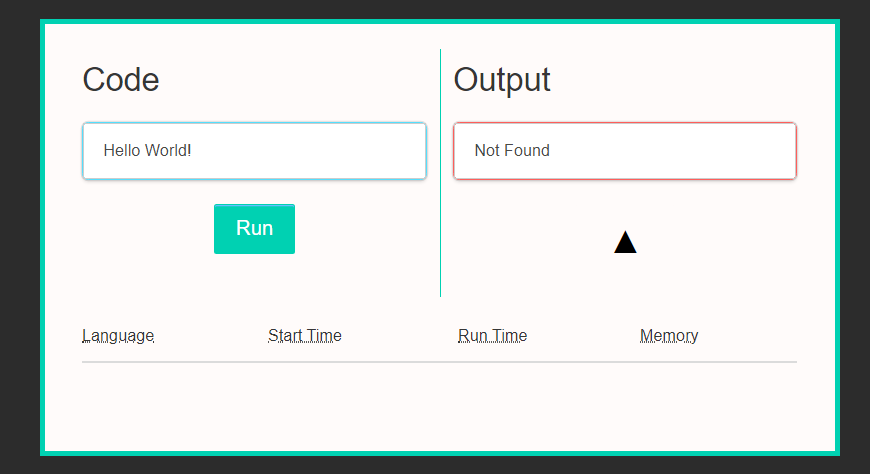

Feather is a chrome browser extension that I helped create as a team during the AngelHack 2017 competition. This project helped me learn how to manage time effectively, how to design and create a browser extention, and the difficulties of creating a secure code executor. 

Feather was created using the [Flask](http://flask.pocoo.org/) web framework, [Moon](https://kbrsh.github.io/moon/) for the JavaScript UI library, and [Chartist](https://gionkunz.github.io/chartist-js/) to display our analytics. 

The Feather extension allowed its users to safely and easily edit and compile/execute code snippets they found on Github and StackOverflow. Our team of college students built a working prototype overnight and the core features were completed. During the course of creating this project, I gained experience with Python and JavaScript.
 
Source: <a href="https://github.com/Zicero/Feather"><i class="large github icon"></i>Zicero/Feather</a>
