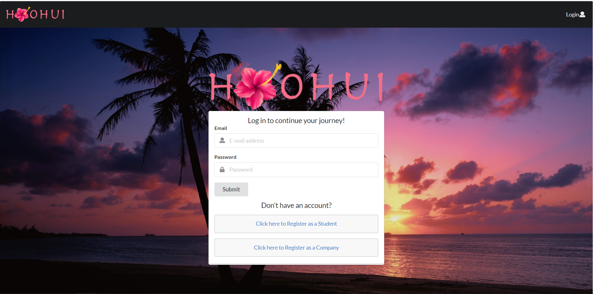

Students and companies could use all the help they could get when it comes to finding a job or finding 
the right person for a job. The process can be complicated, time consuming, and overall just a pain for 
everyone. Ho'ohui was created to solve these problems. The goal of the website was to make a convenient 
and easy-to-use web application that allows companies and students to connect with each other. We do this 
by providing a platform for the students to showcase their skills and companies to advertise their job openings.

During the implementation of the project we had three milestones. Each one helped to keep the project on track 
and finished up in a timely manner. During the first milestone, we came up with mockups, created a landing page, 
and tried to refine our idea. During the second milestone, we added functionality to our core pages, designed our landing page, 
and came up with a style for our website. Finally, for the last milestone we finished adding functionality to the large majority 
of our pages, cleaned up the site, and double checked to make sure our project was good to go. There are 
a few things we still need to work on, but we will get to them in the near future.

Ho'ohui was built by a team of 314 software engineers. I mainly worked on the landing, listing pages, and general styling of the website. During the course of the project, I was able to refine my web design skills and practice project management. In the future, I would love to work on redesigning and implementing a fully-functional Ho'ohui, but as a first go it was an all-around great experience.

Website: <a href="https://hoohui.meteorapp.com/">Ho'ohui</a>

User Guide: <a href="https://ho-ohui.github.io/">Ho'ohui User Guide</a>

Source: <a href="https://github.com/ho-ohui/hoohui"><i class="large github icon "></i>ho-ohui/hoohui</a>
